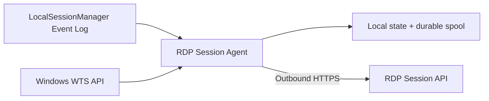
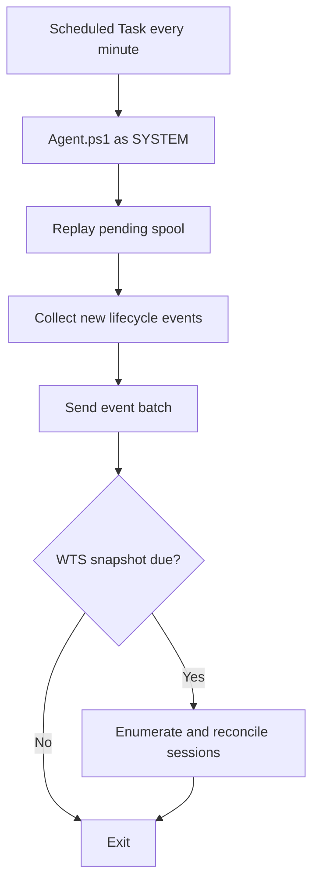

# RDP Session Agent

RDP Session Agent is the Windows-side collector of the RDP Session monitoring stack. It runs locally on each monitored Windows Server, captures Remote Desktop Services lifecycle events, periodically reconciles current sessions through the native Windows Terminal Services API, and sends telemetry to the companion **RDP Session API**.

The project is intentionally infrastructure-agnostic. This repository does **not** contain real API URLs, server IDs, credentials, internal hostnames, network addresses, or organization-specific deployment values.

The central service is maintained separately in [RDP-Session-API](https://github.com/diogowermann/RDP-Session-API).

## Current capabilities

- Windows Server 2012 through Windows Server 2022 compatibility target.
- Windows PowerShell 3.0-compatible runtime code.
- Event IDs 21, 23, 24 and 25 from `Microsoft-Windows-TerminalServices-LocalSessionManager/Operational`.
- Native Windows Terminal Services (WTS) current-session snapshots.
- Event collection every minute through Windows Task Scheduler.
- WTS reconciliation every five minutes by default.
- Scheduled Task execution as `SYSTEM` with highest privileges.
- No inbound WinRM, SMB, WMI, or Agent listening port required.
- Local DPAPI `LocalMachine` protection for the per-server Agent secret.
- Durable local spool before event delivery.
- Idempotent replay support through the API contract.
- Local checkpoint updated only after successful API acknowledgement.
- Snapshot retry on the next run when WTS delivery fails.

## Event mapping

| Windows event | Agent event | Meaning |
|---|---|---|
| 21 | `LOGON` | New RDP session |
| 23 | `LOGOFF` | Session ended |
| 24 | `DISCONNECT` | Session remains open but disconnected |
| 25 | `RECONNECT` | Disconnected session became active again |

## Collection model



Event Log remains the primary lifecycle source. WTS is a secondary current-state source that corrects drift when an expected lifecycle event is missed or a previous collection window was unavailable.

## Automatic execution



## Documentation

- [Documentation index](docs/README.md)
- [Installation and configuration](docs/installation.md)
- [System architecture](docs/system-architecture.md)

## Typical server onboarding

1. Register the Windows server in RDP Session API.
2. Securely obtain its unique `server_id` and one-time Agent secret.
3. Clone or copy this repository to the Windows server.
4. Run the prerequisite test from an elevated PowerShell prompt.
5. Run `Install-Agent.ps1` with the API URL, server ID, and Agent secret.
6. Validate the Scheduled Task, local logs, and API server summary.
7. Repeat with unique credentials for every additional server.

## Installation path

The default installed runtime is:

```text
C:\ProgramData\RdpSessionAgent\
```

The Git checkout is only the source used by the installer. The Scheduled Task executes the copy under `C:\ProgramData\RdpSessionAgent`.

After a repository update, **re-run `Install-Agent.ps1`**. A `git pull` alone does not update the installed runtime.

## Security model

- The Agent receives only its own server-specific ingestion credential.
- The plaintext Agent secret is not retained in `config.json`.
- `credential.dat` is protected with DPAPI machine scope.
- The installation ACL is restricted to `SYSTEM` and local Administrators.
- The Scheduled Task runs locally as `SYSTEM`.
- The Agent requires only outbound HTTPS connectivity to the API.
- The Agent never receives the API query key used by Grafana or other consumers.

## Public repository safety

Never commit:

- production API URLs;
- real server IDs or Agent secrets;
- internal DNS names or IP addresses;
- exported logs containing private usernames or infrastructure data;
- certificates or private keys.

All documentation examples use fictitious values intentionally.

## License

Released under the [MIT License](LICENSE).
