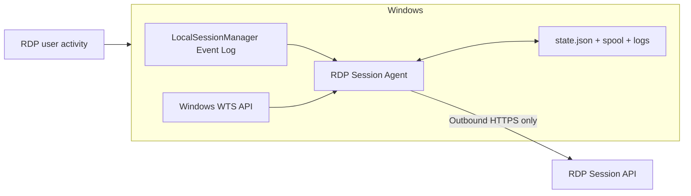
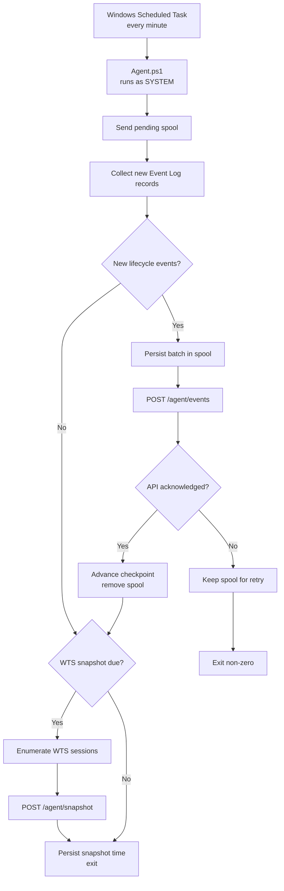
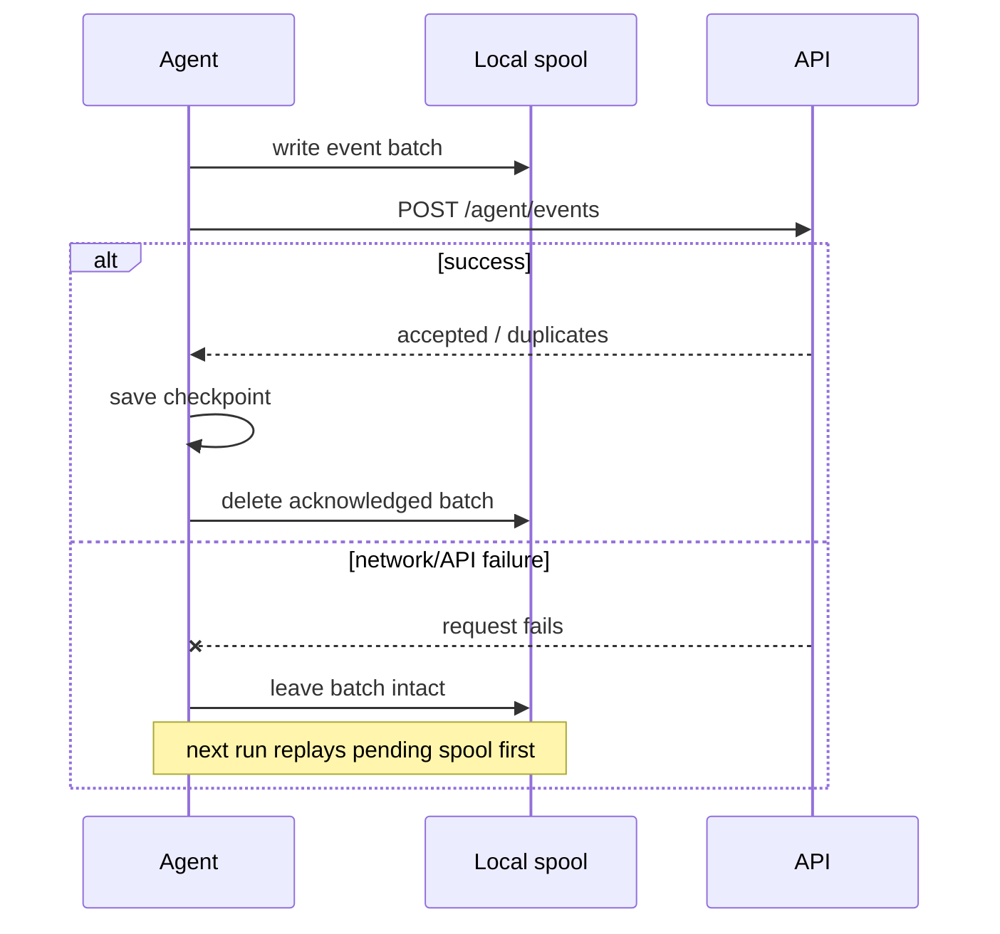
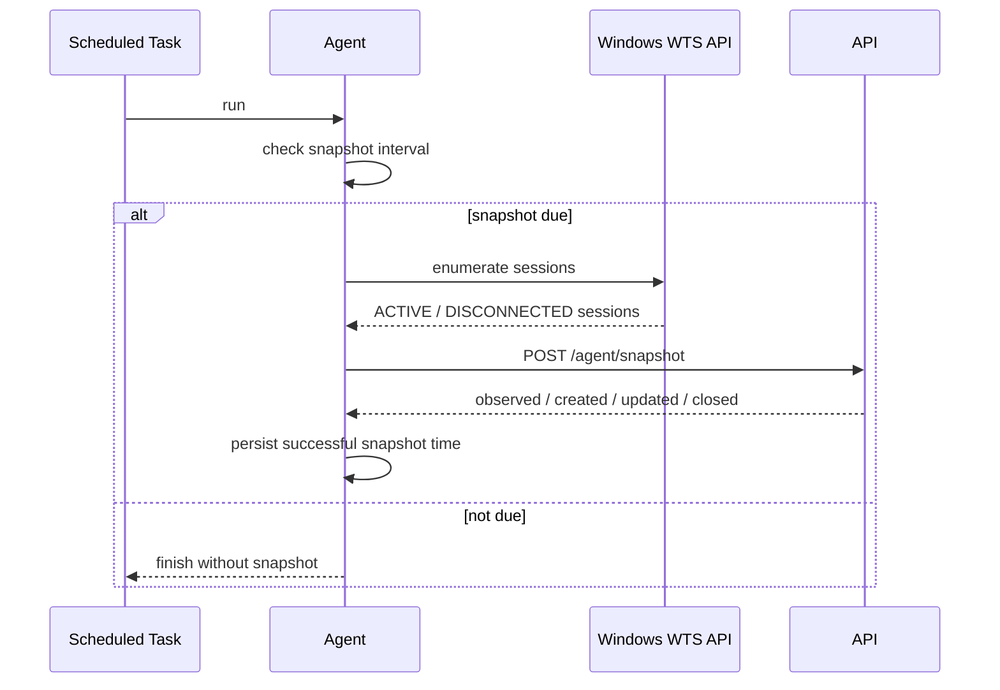
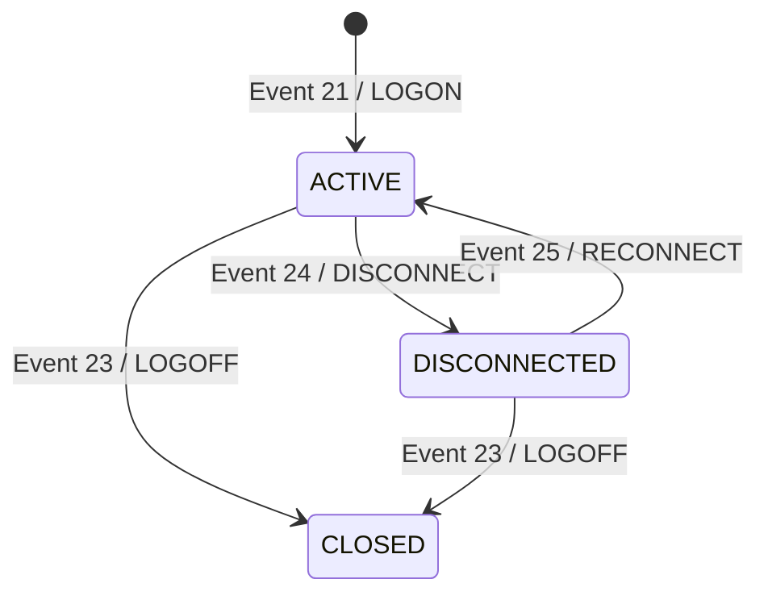
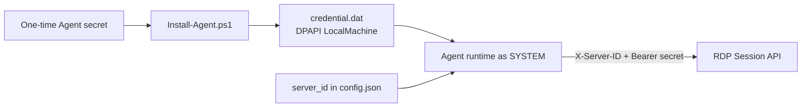
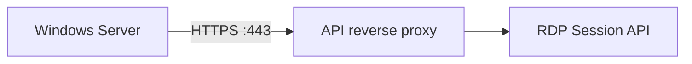
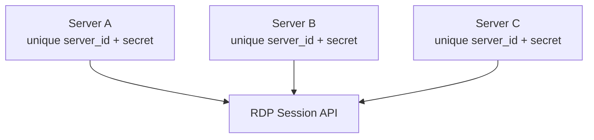
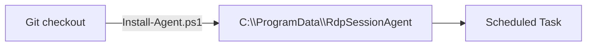

# RDP Session Agent — system architecture

> Technical reference for the Windows collector. The code remains the authority when implementation and documentation differ.

## 1. Purpose

RDP Session Agent runs locally on a monitored Windows Server and forwards Remote Desktop Services session telemetry to RDP Session API.

The design combines two Windows data sources:

- **LocalSessionManager Event Log** for lifecycle transitions;
- **Windows Terminal Services (WTS) API** for periodic current-state reconciliation.

## 2. Repository boundary

| Repository | Responsibility |
|---|---|
| `RDP-Session-Agent` | Windows collection, local persistence, retry behavior, WTS reconciliation, Scheduled Task installation |
| `RDP-Session-API` | Central authentication, ingestion, state consolidation, database persistence and queries |

## 3. Context view



## 4. Data sources

### 4.1 LocalSessionManager Event Log

The Agent reads:

```text
Microsoft-Windows-TerminalServices-LocalSessionManager/Operational
```

Relevant events:

| Event ID | Normalized type | Meaning |
|---|---|---|
| 21 | `LOGON` | New session |
| 23 | `LOGOFF` | Session ended |
| 24 | `DISCONNECT` | Session remains open but disconnected |
| 25 | `RECONNECT` | Existing disconnected session is active again |

Event Log is the primary source for lifecycle chronology.

### 4.2 WTS API

The Agent calls native `wtsapi32.dll` functions to enumerate current local Terminal Services sessions.

Only relevant RDP sessions in current `ACTIVE` or `DISCONNECTED` state are included in the snapshot sent to the API.

WTS is the secondary current-state source used to correct drift.

## 5. Scheduled execution



## 6. Local persistence

Default runtime path:

```text
C:\ProgramData\RdpSessionAgent\
```

```mermaid
flowchart LR
    Config["config.json"] --> Agent["Agent runtime"]
    Credential["credential.dat\nDPAPI LocalMachine"] --> Agent
    State["state.json"] <--> Agent
    Spool["spool/*.json"] <--> Agent
    Logs["logs/*.log"] <-- Agent
```

### `config.json`

Stores non-secret runtime configuration such as API base URL, server ID, Event Log channel, batch size, and snapshot interval.

### `credential.dat`

Stores the Agent secret encrypted using Windows DPAPI machine scope.

### `state.json`

Stores the Event Log checkpoint and the last successful WTS snapshot timestamp.

### `spool\`

Stores event batches durably before transmission.

## 7. Event delivery reliability



The checkpoint advances only after API acknowledgement. This prevents an event batch from being forgotten after a failed request.

The API implements idempotent ingestion, so replaying an already accepted event is safe.

## 8. WTS reconciliation



WTS allows the central state to recover when:

- an expected Event Log lifecycle record was missed;
- the Agent or API was temporarily unavailable;
- an API session remains open but no longer exists locally.

A missing open session can be closed by the API with:

```text
end_reason=RECONCILIATION
```

## 9. Lifecycle model

The Agent reports transitions; the API owns the consolidated state machine.



WTS snapshots can independently correct the current `ACTIVE` / `DISCONNECTED` state or cause a missing session to be reconciled closed by the API.

## 10. Authentication and secret handling



Security properties:

- one credential per monitored server;
- plaintext secret is not written to `config.json`;
- installed directory ACL is restricted;
- runtime executes as `SYSTEM`;
- no query API key is stored by the Agent;
- no inbound Agent service is exposed.

## 11. TLS and network model



The Agent expects the Windows certificate trust store to validate the API endpoint normally. Production deployment should not require certificate-validation bypasses.

## 12. Multi-server deployment

One Agent instance is installed independently on each Windows Server.



Do not clone one server's installed `config.json`, `credential.dat`, or `state.json` to another server. Register and install each server independently.

## 13. Upgrade model

The Git repository checkout and installed runtime are intentionally separate.



After `git pull`, the installer must be run again to refresh the installed runtime and Scheduled Task.

## 14. Current limitations

The current design does not include:

- automatic Agent self-update;
- Windows service packaging;
- a dedicated Event Log reset/gap recovery mechanism beyond WTS reconciliation.
